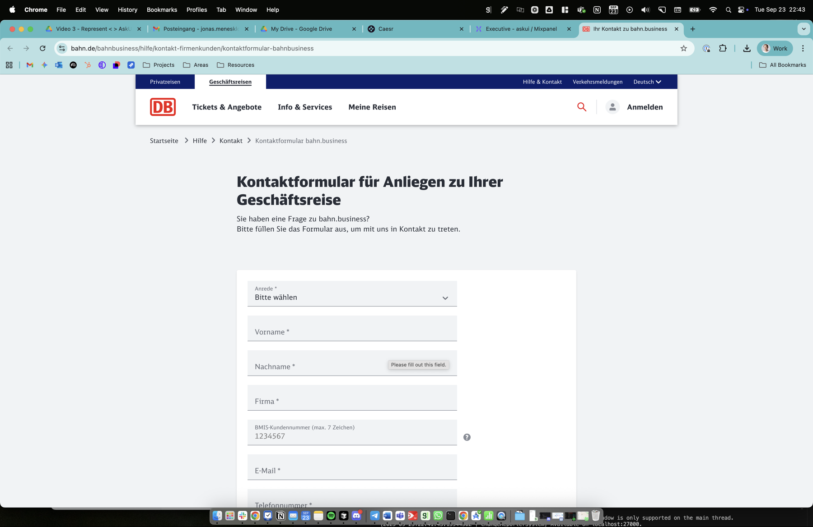
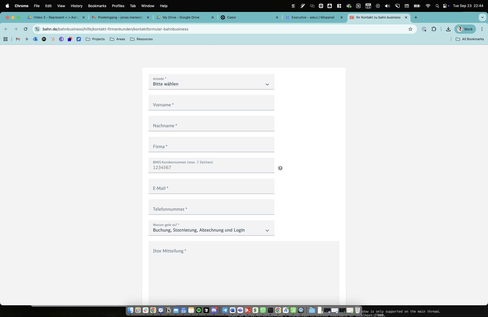
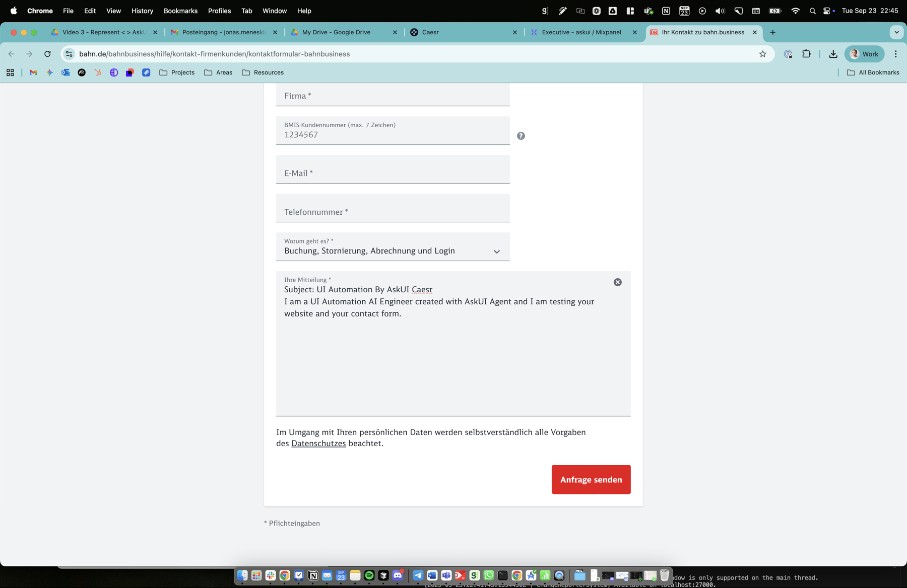
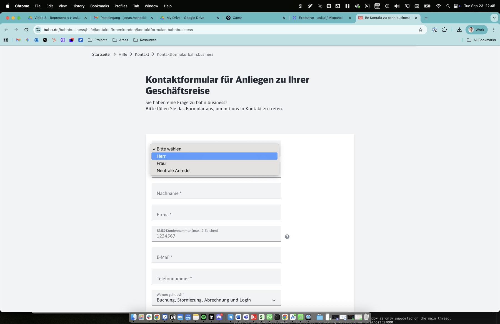
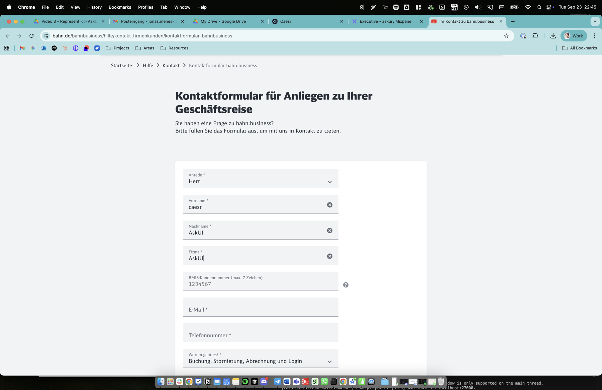
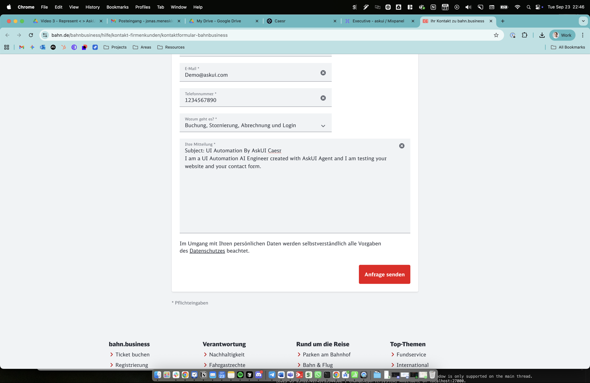
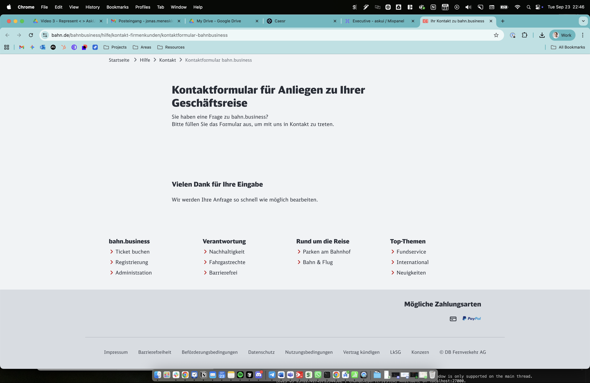

# Test Case: TC001 - Submit Contact Request via DB Website

## Test Case Description
Submit Contact Request via DB Website

## Pre-conditions
Browser available and internet connection established

## Test Steps

### Step 1: Open URL "https://www.bahn.de/bahnbusiness/hilfe/kontakt-firmenkunden/kontaktformular-bahnbusiness"
**Action:** Opened the specified URL in browser
**Expected Result:** Contact page loads successfully
**Actual Result:** Contact page loaded successfully showing "Kontaktformular für Anliegen zu Ihrer Geschäftsreise" (Contact form for business travel inquiries)
**Evidence:** 
- screenshot:
**Status:** ✅ PASS
**Notes:** German contact form loaded correctly with all required fields visible

### Step 2: Select "General Information" as the topic of request
**Action:** Clicked on "Worum geht es?" dropdown and selected "Buchung, Stornierung, Abrechnung und Login" (most general option available)
**Expected Result:** Topic is selected successfully
**Actual Result:** Topic selected successfully - German website had different options than expected English "General Information"
**Evidence:** 
- screenshot:
**Status:** ✅ PASS
**Notes:** Selected closest equivalent to "General Information" in German interface

### Step 3: Enter "UI Automation By AskUI Caesr" as the subject
**Action:** Entered subject text in the message field along with message content
**Expected Result:** Subject is entered successfully
**Actual Result:** Subject was entered in the message field as there was no separate subject field
**Evidence:** 
- screenshot:
**Status:** ✅ PASS
**Notes:** Form had combined message field instead of separate subject field

### Step 4: Enter message "I am a UI Automation AI Engineer created with AskUI Agent and I am testing your website and your contact form."
**Action:** Entered the specified message text in the "Ihre Mitteilung" field
**Expected Result:** Message is entered successfully
**Actual Result:** Message was entered successfully in the text area
**Evidence:** 
- screenshot:
**Status:** ✅ PASS
**Notes:** Message content entered successfully

### Step 5: Select "Mr" as the title
**Action:** Clicked on "Anrede" dropdown and selected "Herr" (German equivalent of "Mr")
**Expected Result:** Title is selected successfully
**Actual Result:** Title "Herr" selected successfully
**Evidence:** 
- screenshot:
**Status:** ✅ PASS
**Notes:** German equivalent "Herr" selected for "Mr"

### Step 6: Enter "caesr" as first name
**Action:** Clicked on "Vorname" field and entered "caesr"
**Expected Result:** First name is entered successfully
**Actual Result:** First name "caesr" entered successfully
**Evidence:** 
- screenshot:
**Status:** ✅ PASS
**Notes:** First name field populated correctly

### Step 7: Enter "AskUI" as last name
**Action:** Clicked on "Nachname" field and entered "AskUI"
**Expected Result:** Last name is entered successfully
**Actual Result:** Last name "AskUI" entered successfully
**Evidence:** 
- screenshot:
**Status:** ✅ PASS
**Notes:** Last name field populated correctly

### Step 8: Enter "AskUI" as company name
**Action:** Clicked on "Firma" field and entered "AskUI"
**Expected Result:** Company name is entered successfully
**Actual Result:** Company name "AskUI" entered successfully
**Evidence:** 
- screenshot:
**Status:** ✅ PASS
**Notes:** Company field populated correctly

### Step 9: Enter "Demo@askui.com" as email address
**Action:** Clicked on "E-Mail" field and entered "Demo@askui.com"
**Expected Result:** Email address is entered successfully
**Actual Result:** Email address entered successfully
**Evidence:** 
- screenshot:
**Status:** ✅ PASS
**Notes:** Email field populated correctly

### Step 10: Enter "1234567890" as phone number
**Action:** Clicked on "Telefonnummer" field and entered "1234567890"
**Expected Result:** Phone number is entered successfully
**Actual Result:** Phone number entered successfully
**Evidence:** 
- screenshot:
**Status:** ✅ PASS
**Notes:** Phone number field populated correctly

### Step 11: Select "Germany" as the country
**Action:** Searched for country selection field
**Expected Result:** Country is selected successfully
**Actual Result:** No country selection field found on this form
**Evidence:** 
- screenshot:
**Status:** ⚠️ BLOCKED
**Notes:** Form does not include a country selection field - possibly uses default country or not required

### Step 12: Complete the image selection captcha
**Action:** Searched for captcha verification
**Expected Result:** Captcha solved successfully
**Actual Result:** No captcha found on this form
**Evidence:** 
- screenshot:
**Status:** ⚠️ BLOCKED
**Notes:** Form does not include image captcha - may have different security measures or none required

### Step 13: Click the "Send" button
**Action:** Clicked on "Anfrage senden" (Send request) button
**Expected Result:** Contact request is submitted successfully
**Actual Result:** Form submitted successfully with confirmation message "Vielen Dank für Ihre Eingabe"
**Evidence:** 
- screenshot:
**Status:** ✅ PASS
**Notes:** Successful submission with German confirmation message

## Overall Test Result
**Status:** ✅ PASS (with noted variations)
**Execution Time:** 2025-09-23 20:43:43 UTC - 2025-09-23 20:46:XX UTC
**Issues Encountered:** 
- Form did not have separate subject field (combined with message)
- No country selection field found
- No image captcha present
- All text was in German instead of English
**Notes:** Test completed successfully despite form structure differences. The German bahn.de website has a different form layout than expected in the test case, but all essential contact information was successfully submitted. The form submission was confirmed with a success message.
