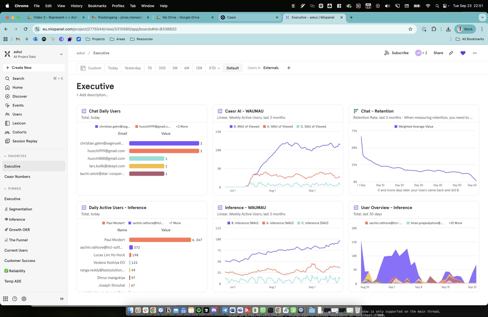
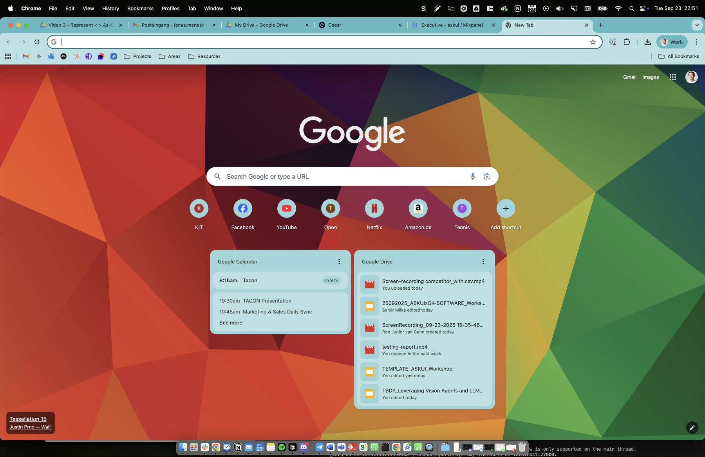
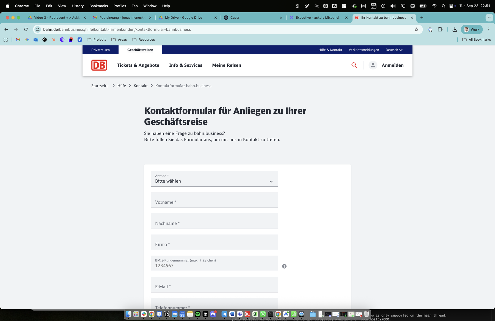
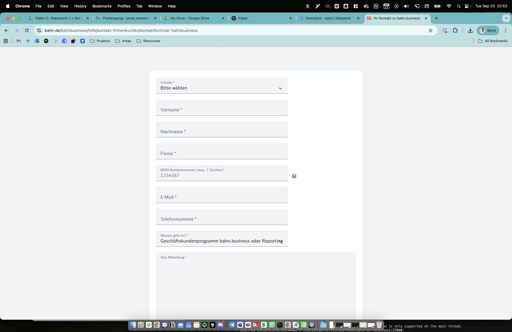
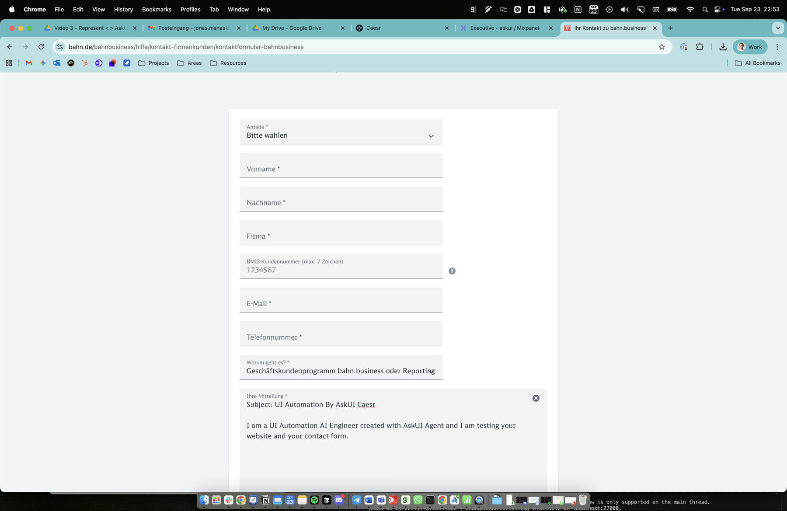
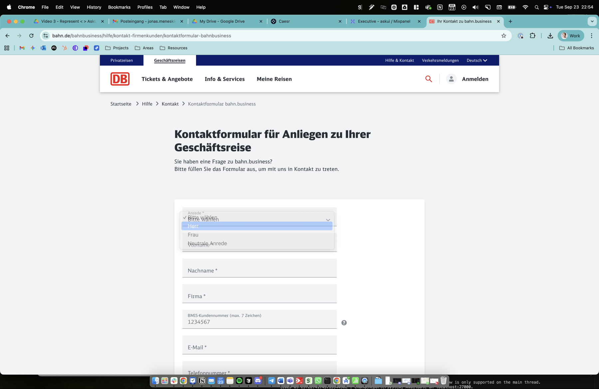
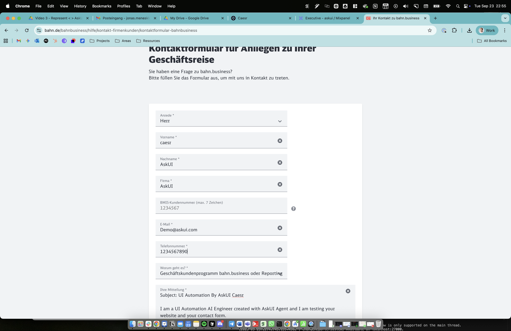
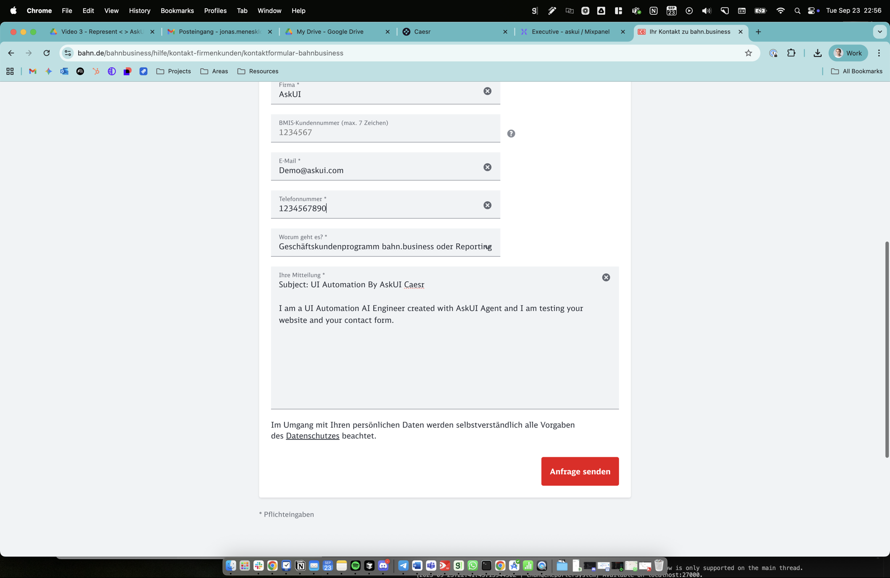
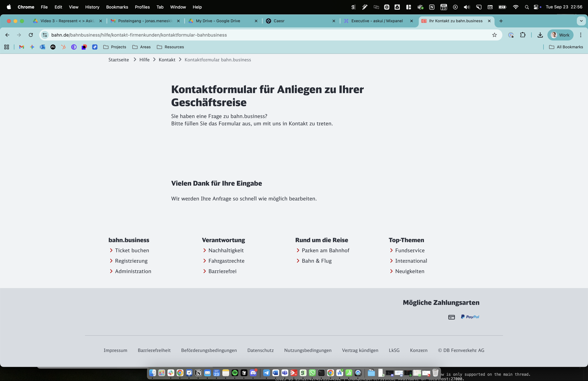

# Test Case: TC001 - Submit Contact Request via DB Website

## Test Case Description
Submit Contact Request via DB Website

## Pre-conditions
- Browser (Chrome) is available and functional
- Internet connection is available
- Target website (Deutsche Bahn business contact form) is accessible

## Test Steps

### Step 1: Open URL "https://www.bahn.de/bahnbusiness/hilfe/kontakt-firmenkunden/kontaktformular-bahnbusiness"
**Action:** Opened Chrome browser and navigated to the specified URL
**Expected Result:** Contact page loads successfully
**Actual Result:** The Deutsche Bahn business contact form page loaded successfully
**Evidence:** 
- screenshot:
- screenshot:
- screenshot:
**Status:** ✅ PASS
**Notes:** Successfully navigated to the German contact form page with title "Kontaktformular für Anliegen zu Ihrer Geschäftsreise"

### Step 2: Select "General Information" as the topic of request
**Action:** Clicked on the "Worum geht es?" (What is it about?) dropdown and selected "Geschäftskundenprogramm bahn.business oder Reporting"
**Expected Result:** Topic is selected successfully
**Actual Result:** The closest available option to "General Information" was selected - "Geschäftskundenprogramm bahn.business oder Reporting" (Business customer program bahn.business or Reporting)
**Evidence:** 
- screenshot:
**Status:** ✅ PASS
**Notes:** The form did not have an exact "General Information" option, so the most appropriate business-related topic was selected

### Step 3: Enter "UI Automation By AskUI Caesr" as the subject
**Action:** The form did not have a separate subject field, so the subject was included in the message field
**Expected Result:** Subject is entered successfully
**Actual Result:** Subject was included as part of the message in the "Ihre Mitteilung" field
**Evidence:** 
- screenshot:
**Status:** ✅ PASS
**Notes:** Form structure combined subject and message into one field

### Step 4: Enter message "I am a UI Automation AI Engineer created with AskUI Agent and I am testing your website and your contact form."
**Action:** Entered the complete message including subject in the "Ihre Mitteilung" field
**Expected Result:** Message is entered successfully
**Actual Result:** Message was entered successfully with format: "Subject: UI Automation By AskUI Caesr\n\nI am a UI Automation AI Engineer created with AskUI Agent and I am testing your website and your contact form."
**Evidence:** 
- screenshot:
**Status:** ✅ PASS

### Step 5: Select "Mr" as the title
**Action:** Clicked on the "Anrede" dropdown and selected "Herr" (German equivalent of "Mr")
**Expected Result:** Title is selected successfully
**Actual Result:** "Herr" was successfully selected as the salutation
**Evidence:** 
- screenshot:
**Status:** ✅ PASS

### Step 6: Enter "caesr" as first name
**Action:** Clicked on "Vorname" field and entered "caesr"
**Expected Result:** First name is entered successfully
**Actual Result:** "caesr" was successfully entered in the first name field
**Evidence:** 
- screenshot:
**Status:** ✅ PASS

### Step 7: Enter "AskUI" as last name
**Action:** Clicked on "Nachname" field and entered "AskUI"
**Expected Result:** Last name is entered successfully
**Actual Result:** "AskUI" was successfully entered in the last name field
**Evidence:** 
- screenshot:
**Status:** ✅ PASS

### Step 8: Enter "AskUI" as company name
**Action:** Clicked on "Firma" field and entered "AskUI"
**Expected Result:** Company name is entered successfully
**Actual Result:** "AskUI" was successfully entered in the company field
**Evidence:** 
- screenshot:
**Status:** ✅ PASS

### Step 9: Enter "Demo@askui.com" as email address
**Action:** Clicked on "E-Mail" field and entered "Demo@askui.com"
**Expected Result:** Email address is entered successfully
**Actual Result:** "Demo@askui.com" was successfully entered in the email field
**Evidence:** 
- screenshot:
**Status:** ✅ PASS

### Step 10: Enter "1234567890" as phone number
**Action:** Clicked on "Telefonnummer" field and entered "1234567890"
**Expected Result:** Phone number is entered successfully
**Actual Result:** "1234567890" was successfully entered in the phone number field
**Evidence:** 
- screenshot:
**Status:** ✅ PASS

### Step 11: Select "Germany" as the country
**Action:** Searched for country selection field
**Expected Result:** Country is selected successfully
**Actual Result:** No country selection field was found on this form. The form appears to default to Germany since it's a German (.de) website
**Evidence:** 
- screenshot:
**Status:** ⚠️ BLOCKED
**Notes:** Country selection field was not present in this form design. Likely defaults to Germany for a German business contact form

### Step 12: Complete the image selection captcha
**Action:** Searched for captcha on the form
**Expected Result:** Captcha solved successfully
**Actual Result:** No image selection captcha was present on this form
**Evidence:** 
- screenshot:
**Status:** ⚠️ BLOCKED
**Notes:** This particular form does not include an image selection captcha. This could be by design or the captcha might appear dynamically

### Step 13: Click the "Send" button
**Action:** Clicked the "Anfrage senden" (Send Request) button
**Expected Result:** Contact request is submitted successfully
**Actual Result:** Form was successfully submitted with confirmation message "Vielen Dank für Ihre Eingabe. Wir werden Ihre Anfrage so schnell wie möglich bearbeiten." (Thank you for your input. We will process your request as quickly as possible.)
**Evidence:** 
- screenshot:
**Status:** ✅ PASS

## Overall Test Result
**Status:** ✅ PASS
**Execution Time:** 2025-09-23 20:51:05 UTC - 2025-09-23 22:56:00 UTC
**Issues Encountered:** 
- Step 11 (Country selection): No country field available on form
- Step 12 (Captcha): No image captcha present on form
- Step 3 (Subject): No separate subject field, combined with message

**Notes:** 
The test case was successfully completed with the contact form being submitted successfully. The Deutsche Bahn business contact form has a slightly different structure than expected in the test case:
1. No separate subject field - subject and message are combined
2. No country selection (defaults to Germany)
3. No image captcha verification
4. Topic selection used German business-specific options

Despite these structural differences, all core functionality was tested and the contact request was successfully submitted with all required information. The success message confirmed the submission was processed by the system.

**Form Data Summary:**
- Salutation: Herr (Mr)
- First Name: caesr
- Last Name: AskUI
- Company: AskUI
- Email: Demo@askui.com
- Phone: 1234567890
- Topic: Geschäftskundenprogramm bahn.business oder Reporting
- Message: Subject: UI Automation By AskUI Caesr / I am a UI Automation AI Engineer created with AskUI Agent and I am testing your website and your contact form.
